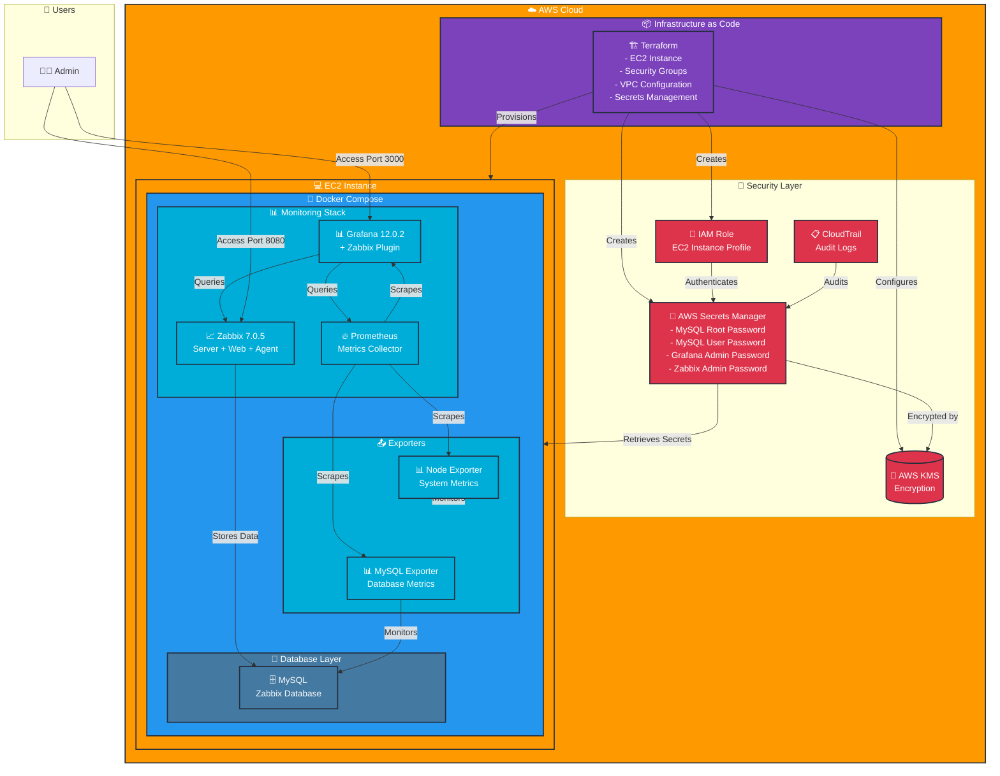
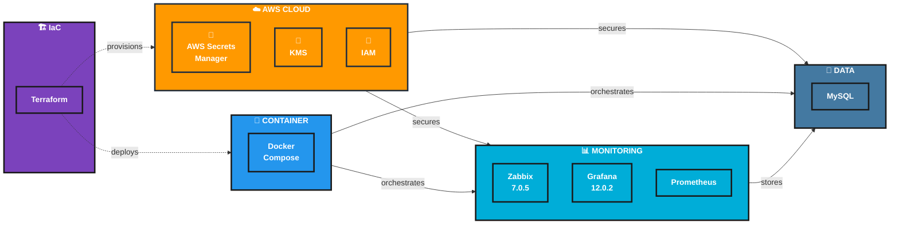
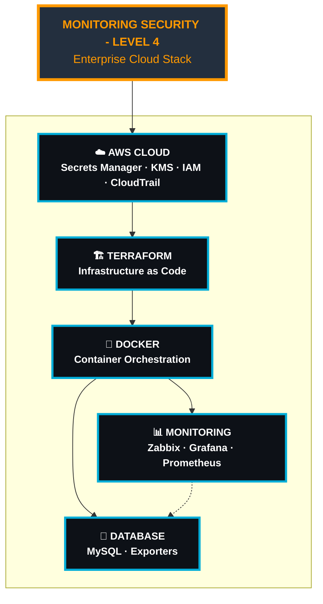
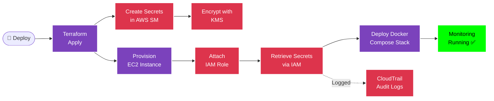

# Diagramas do Projeto - Monitoring Security Level 4

## 1. Diagrama Completo - Arquitetura Detalhada (Para README)



---

## 2. Diagrama Simples - Stack de Tecnologias (Para Capa do Portfólio)



---

## 3. Diagrama Alternativo - Layout Vertical Minimalista (Opção para Capa)



---

## 4. Diagrama Extra - Fluxo de Segurança (Bonus)



---

## Como Usar

### Para o README:
- Use o **Diagrama 1 (Completo)** - mostra toda a arquitetura

### Para Capa do Portfólio:
- Use o **Diagrama 2 (Simples)** - stack de tecnologias horizontal
- OU **Diagrama 3 (Vertical)** - layout mais clean e moderno
- OU **Diagrama 4 (Fluxo)** - mostra o processo de segurança

### Como Converter para JPG:
1. Cole o código no [Mermaid Live Editor](https://mermaid.live/)
2. Ajuste as cores/estilos se necessário
3. Exporte como PNG ou SVG
4. Converta para JPG usando ferramenta online ou:
   ```bash
   convert diagram.png -quality 95 diagram.jpg
   ```

### Dicas de Personalização:
- Ajuste as cores nas classes CSS no final de cada diagrama
- Modifique emojis conforme preferência
- Adicione/remova tecnologias conforme necessário
- Para o portfólio, recomendo o **Diagrama 3** (mais limpo e profissional)
