# Diagramas do Projeto - Monitoring Security Level 4

## 1. Diagrama Completo - Arquitetura Detalhada (Para README)

```mermaid
graph TB
    subgraph AWS["☁️ AWS Cloud"]
        subgraph Security["🔐 Security Layer"]
            KMS[("🔑 AWS KMS<br/>Encryption")]
            SM["🔐 AWS Secrets Manager<br/>- MySQL Root Password<br/>- MySQL User Password<br/>- Grafana Admin Password<br/>- Zabbix Admin Password"]
            IAM["👤 IAM Role<br/>EC2 Instance Profile"]
            CT["📋 CloudTrail<br/>Audit Logs"]
        end
        
        subgraph IaC["📦 Infrastructure as Code"]
            TF["🏗️ Terraform<br/>- EC2 Instance<br/>- Security Groups<br/>- VPC Configuration<br/>- Secrets Management"]
        end
        
        subgraph Compute["💻 EC2 Instance"]
            subgraph Docker["🐳 Docker Compose"]
                subgraph Monitoring["📊 Monitoring Stack"]
                    Zabbix["📈 Zabbix 7.0.5<br/>Server + Web + Agent"]
                    Grafana["📊 Grafana 12.0.2<br/>+ Zabbix Plugin"]
                    Prometheus["🔥 Prometheus<br/>Metrics Collector"]
                end
                
                subgraph Database["💾 Database Layer"]
                    MySQL["🗄️ MySQL<br/>Zabbix Database"]
                end
                
                subgraph Exporters["📤 Exporters"]
                    NodeExp["📊 Node Exporter<br/>System Metrics"]
                    MySQLExp["📊 MySQL Exporter<br/>Database Metrics"]
                end
            end
        end
    end
    
    subgraph Users["👥 Users"]
        Admin["👨‍💻 Admin"]
    end
    
    %% Connections
    TF -->|Provisions| Compute
    TF -->|Creates| SM
    TF -->|Configures| KMS
    TF -->|Creates| IAM
    
    SM -->|Encrypted by| KMS
    IAM -->|Authenticates| SM
    SM -->|Retrieves Secrets| Docker
    CT -->|Audits| SM
    
    Zabbix -->|Stores Data| MySQL
    Grafana -->|Queries| Zabbix
    Grafana -->|Queries| Prometheus
    Prometheus -->|Scrapes| NodeExp
    Prometheus -->|Scrapes| MySQLExp
    Prometheus -->|Scrapes| Grafana
    MySQLExp -->|Monitors| MySQL
    NodeExp -->|Monitors| Compute
    
    Admin -->|Access Port 8080| Zabbix
    Admin -->|Access Port 3000| Grafana
    
    classDef awsService fill:#FF9900,stroke:#232F3E,stroke-width:2px,color:#fff
    classDef security fill:#DD344C,stroke:#232F3E,stroke-width:2px,color:#fff
    classDef monitoring fill:#00ADD8,stroke:#232F3E,stroke-width:2px,color:#fff
    classDef database fill:#4479A1,stroke:#232F3E,stroke-width:2px,color:#fff
    classDef docker fill:#2496ED,stroke:#232F3E,stroke-width:2px,color:#fff
    classDef terraform fill:#7B42BC,stroke:#232F3E,stroke-width:2px,color:#fff
    
    class AWS,Compute awsService
    class KMS,SM,IAM,CT security
    class Zabbix,Grafana,Prometheus,NodeExp,MySQLExp,Monitoring,Exporters monitoring
    class MySQL,Database database
    class Docker docker
    class TF,IaC terraform
```



---

## 2. Diagrama Simples - Stack de Tecnologias (Para Capa do Portfólio)


---

## 3. Diagrama Alternativo - Layout Vertical Minimalista (Opção para Capa)

```mermaid
graph TD
    Title["<b>MONITORING SECURITY - LEVEL 4</b><br/>Enterprise Cloud Stack"]
    
    subgraph Stack[" "]
        direction TB
        
        AWS["☁️ <b>AWS CLOUD</b><br/>Secrets Manager · KMS · IAM · CloudTrail"]
        
        Terraform["🏗️ <b>TERRAFORM</b><br/>Infrastructure as Code"]
        
        Monitor["📊 <b>MONITORING</b><br/>Zabbix · Grafana · Prometheus"]
        
        Database["💾 <b>DATABASE</b><br/>MySQL · Exporters"]
        
        Docker["🐳 <b>DOCKER</b><br/>Container Orchestration"]
    end
    
    Title --> AWS
    AWS --> Terraform
    Terraform --> Docker
    Docker --> Monitor
    Docker --> Database
    Monitor -.-> Database
    
    classDef title fill:#232F3E,stroke:#FF9900,stroke-width:4px,color:#FF9900,font-size:16px
    classDef tech fill:#0D1117,stroke:#00ADD8,stroke-width:3px,color:#fff,font-size:14px,font-weight:bold
    
    class Title title
    class AWS,Terraform,Monitor,Database,Docker tech
```



---

## 4. Diagrama Extra - Fluxo de Segurança (Bonus)

```mermaid
flowchart LR
    Start([🚀 Deploy])
    
    TF[Terraform<br/>Apply]
    
    Secrets[Create Secrets<br/>in AWS SM]
    
    Encrypt[Encrypt with<br/>KMS]
    
    EC2[Provision<br/>EC2 Instance]
    
    IAM[Attach<br/>IAM Role]
    
    Retrieve[Retrieve Secrets<br/>via IAM]
    
    Deploy[Deploy Docker<br/>Compose Stack]
    
    Monitor[Monitoring<br/>Running ✅]
    
    Audit[CloudTrail<br/>Audit Logs]
    
    Start --> TF
    TF --> Secrets
    Secrets --> Encrypt
    TF --> EC2
    EC2 --> IAM
    IAM --> Retrieve
    Retrieve --> Deploy
    Deploy --> Monitor
    Retrieve -.->|Logged| Audit
    
    classDef process fill:#7B42BC,stroke:#fff,stroke-width:2px,color:#fff
    classDef security fill:#DD344C,stroke:#fff,stroke-width:2px,color:#fff
    classDef success fill:#00FF00,stroke:#fff,stroke-width:2px,color:#000
    
    class TF,EC2,Deploy process
    class Secrets,Encrypt,IAM,Retrieve,Audit security
    class Monitor success
```



---

## Como Usar

### Para o README:
- Use o **Diagrama 1 (Completo)** - mostra toda a arquitetura

### Para Capa do Portfólio:
- Use o **Diagrama 2 (Simples)** - stack de tecnologias horizontal
- OU **Diagrama 3 (Vertical)** - layout mais clean e moderno
- OU **Diagrama 4 (Fluxo)** - mostra o processo de segurança

### Como Converter para JPG:
1. Cole o código no [Mermaid Live Editor](https://mermaid.live/)
2. Ajuste as cores/estilos se necessário
3. Exporte como PNG ou SVG
4. Converta para JPG usando ferramenta online ou:
   ```bash
   convert diagram.png -quality 95 diagram.jpg
   ```

### Dicas de Personalização:
- Ajuste as cores nas classes CSS no final de cada diagrama
- Modifique emojis conforme preferência
- Adicione/remova tecnologias conforme necessário
- Para o portfólio, recomendo o **Diagrama 3** (mais limpo e profissional)
